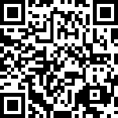

# docs.cloudinfra.podcast

のぼりーさんのクラウドインフラPodCast関連公開資料です。

 
本作品には、知られている限り、著作権の制約が存在していません。

## PodCastの概要

Tech系Podcastのひとつとして。
AWS,AzureやGCPに代表されるクラウドサービスを中心に(※最近わりと何でもアリ...)ゲストを招いてお話をします。
内容はインフラストラクチャ寄りで、サービスそのものについてや、それを利用したアーキテクチャについて語ります。

扱うものの性質上、ポジショントーク、宣伝、ビジネスなトークも普通に歓迎します。

- 配信[SoundCloud](https://soundcloud.com/cloudinfra_podcast_ja)
- メモ置き場(Liner Notes) [https://cloudinfra.audio | Medium ](https://cloudinfra.audio)

配信は不定期で、1-2ヶ月に1本程度です。

### 企画:ゴールデンTechGuy酒場

(主に)新宿ゴールデン街の無銘喫茶で収録する回です。[山田店長](https://twitter.com/nii_yan)(リクルートライフスタイル)[吉田スカウト](https://twitter.com/yoshidashingo)(CYDAS)と[司会進行 澤登](https://twitter.com/sawanoboly) でお送りします。

音声は通常回と同じように配信しますが、映像付きの生放送がついています。ゲスト参加の飛び入りも歓迎。

- 生配信Twitchチャンネル https://www.twitch.tv/nobolycloud

こちらも開催は不定期かつ無銘喫茶の空き状況に依存してて、1-2ヶ月に1本程度です。

## 収録およびイベント用Discordコミュニティ

各種クラウドベンダやコミュニティのイベントを、自宅などの現地以外でLiveStream鑑賞しながらVoiceチャットをつないで実況・解説および適当なだべりをする目的でDiscordサーバ`nobolycloud`をオープンしています。

- Discord招待リンクはこちら => [https://discord.gg/AxAwMER](https://discord.gg/AxAwMER)

## 収録のゲストについて

Podcastのゲストは大抵DM等で突然依頼か、全く面識なければ伝手を通して打診します。承諾頂ける場合は下記の段取りを追って準備を進めてください。

1. [事前調整](./for_guest/10_Preconditioning.md)
1. [機材の用意](./for_guest/20_Equipments.md)
1. [収録](./for_guest/30_Recording.md)

## ホストの録音について

いまはこのような環境。 => [https://www.sawanoboly.net/2017/11/discord-ah/](https://www.sawanoboly.net/2017/11/discord-ah/)

## 編集

ざっくり以下の順番でツールを通していきます。

- iZotope RX7 Elements: 自分のリップノイズとか除去
  - Audacity: 全体のノイズ除去 (有料のiZotope RX7導入により予備へ)
- Logic Pro X: カット編集&エフェクト
- The Levelator: レベル調整
- Forecast: チャプター & mp3 output

編集に費やす時間はノイズ状況・ロケーションや参加人数によりけりで、収録時間 x 1.5から3.0 くらい目安。

## 配信

3箇所で調整しつつ。

- SoundCloud: mp3ホスティング
- Medium: Shownote
- Patreon: おまけのmp3

## サポーター

patreonにて、1トラックあたり￥100または￥200の設定でお申し込みが可能です。

- https://www.patreon.com/nobolycloud

また、別口で投げ銭して頂ける場合のBitcoinアドレスはこちら。

Bitcoin addr: `1H2gxrCgLGKUXPrVdwQ7prHYAkqfhPQBdc`

----

こちらはBitcoin Cash.

Bitcoin Cash addr: `qzha8jdsk4eaeh7ef4r78pr6lj3pglfasc6sw4wxzv`

### Brave Payments

他にも、[Brave](https://brave.com/clo953)というブラウザがコンテンツの閲覧とクリエイターへの投げ銭を両立させる仕組みを運用してみているとのことで、関連サイトやドメインなどを登録しています。

現在以下のコンテンツを[Brave](https://brave.com/clo953)で閲覧すると暗号通貨`BAT`として投げ銭できる模様です。

- [https://cloudinfra.audio/](https://cloudinfra.audio/) のコンテンツ
- Twitchの[nobolycloudチャンネル](https://www.twitch.tv/nobolycloud)

## スポンサー

こちら => [nobolycloud スポンサーのお申込みについて](./Sponsor.md)
